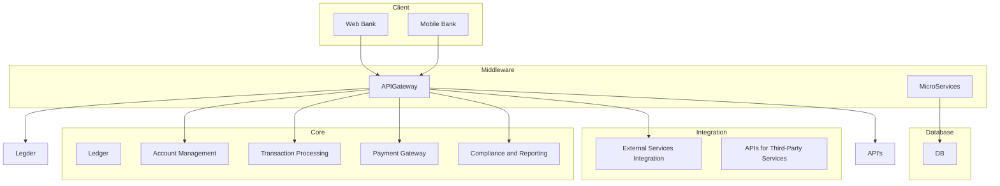

# Componentes

## Core

O **Core** é o coração da arquitetura, responsável pelo processamento de todas as operações bancárias principais. Seus componentes críticos incluem:
  - **Ledger**: Um sistema de registros contábeis que mantém um histórico imutável de todas as transações financeiras.
  - **Account Management**: Módulo responsável pela criação, modificação e encerramento de contas de clientes.
  - **Transaction Processing**: Modulo responsável pelo processamento de todas as transações financeiras, como depósitos, saques, transferências e pagamentos.
  - **Payment Gateway**: Interface para integração com redes de pagamento externas, como processadores de cartões de crédito, redes de transferência eletrônica (ex. PIX, TED, DOC) e outros meios de pagamento.
  - **Compliance and Reporting**: Conjunto de ferramentas e processos que garantem a conformidade com regulamentações financeiras. Gera relatórios financeiros detalhados para fins internos e regulatórios, além de garantir que todas as operações estejam em conformidade com as leis e normas aplicáveis.

